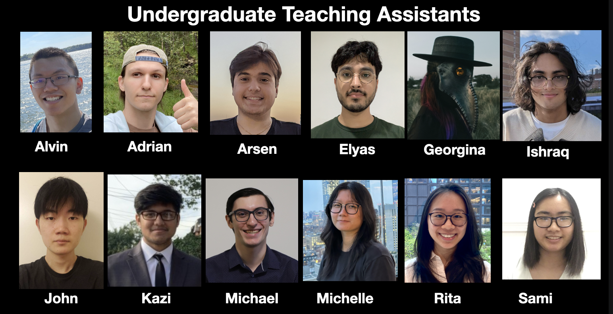

# CSci 235 Spring 2024

## SOFTWARE DESIGN AND ANALYSIS II

________________________________________

The primary focus of this course is the design and analysis of algorithms and abstract data types. To this end it introduces elementary data structures with related algorithms and their use in problem solving. The course also covers core computer science concepts such as abstraction, algorithm complexity, performance analysis and the tradeoffs between running time, storage size, clarity and extensibility that are at the core of software design. As a sequel to CSCI 135, it will also enhance your skills in C++ and Object Oriented Programming by introducing new tools such as Templates, Inheritance, Polymorphism, extend your understanding of pointers and dynamic memory allocation.

* [**Course Schedule**](spring_2024_schedule.md)
* [**Syllabus**](documents/CSCI235_Spring2024_Syllabus.pdf)
* [**Programming Guidelines**](documents/CSCI235_Spring2024_ProgrammingGuidelines.pdf)
* **TUTORING**:
  * Lab 1001B Hunter North (10th floor) 
  * Monday - Friday 11:30am – 5:30pm

   
### Undergraduate Teaching Assisntants (UTAs)

